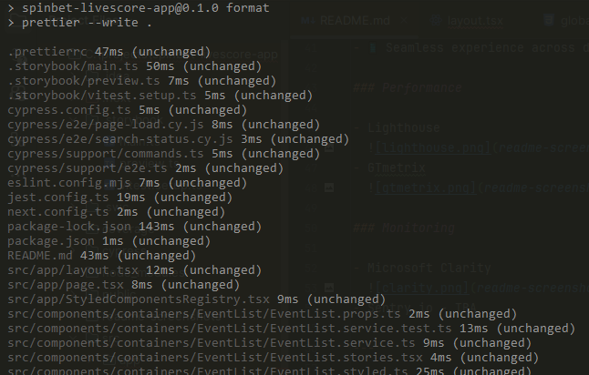
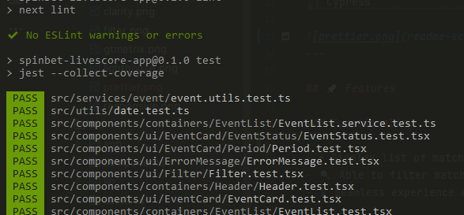
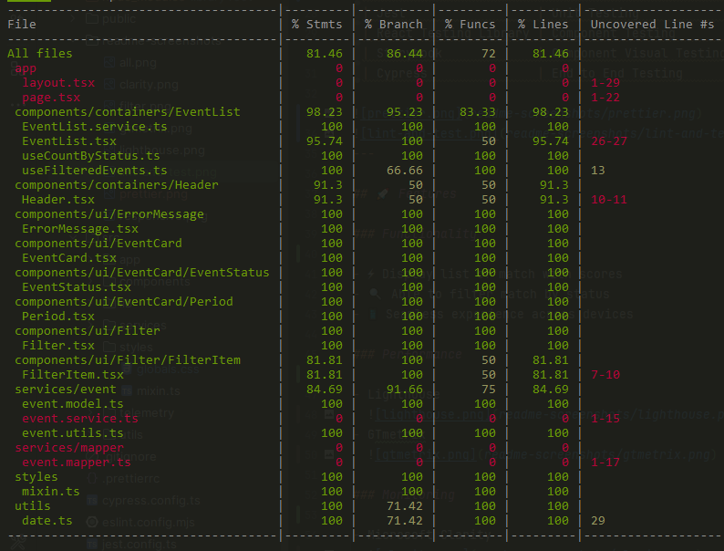
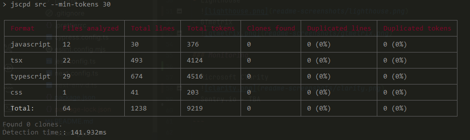
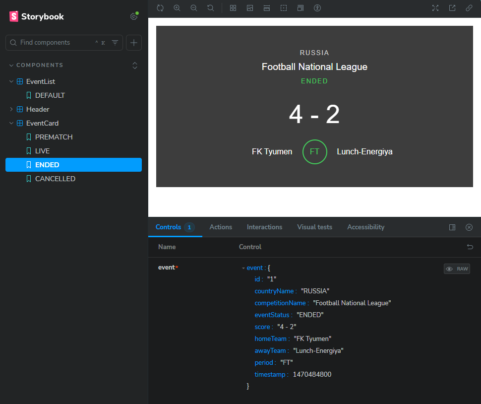
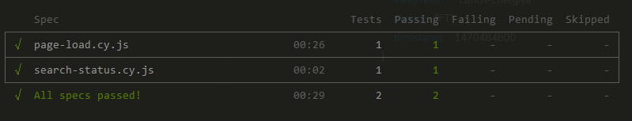
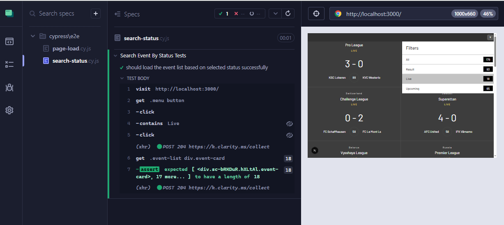

# 🎯 Spinbet Livescore App

## 📝 Project Overview

Spinbet Livescore App is a responsive web application built to simulate live sports match feeds. It parses a static JSON file to display match information, filtering by status (Live, Result, Upcoming) with dynamic counters. Built as part of a coding challenge for a Lead Frontend role.

🌐 [Live Demo](https://spinbet-livescore-app.vercel.app/)

🌐 [Live API Demo](https://spinbet-livescore-api.onrender.com/api/v1/livescore)

📦 [GitHub App Repository](https://github.com/emersonbarrion/spinbet-livescore-app)

📦 [GitHub Api Repository](https://github.com/emersonbarrion/spinbet-livescore-api)

---

## 🛠️ Tech Stack

| Stack                | Deployment |
| -------------------- | ---------- |
| Next.js (frontend)   | Vercel     |
| Express.js (backend) | Render.com |

| Tools                 | Code Quality             |
|-----------------------|--------------------------|
| Styled Component      | Styling                  |
| Prettier              | Formatter                |
| ESLint                | Linter                   |
| Typescript            | Type safety              |
| JSCPD                 | Duplicate code detection |
| Jest                  | Unit Testing             |
| React Testing Library | Component Testing        |
| Storybook             | Component Visual Testing |
| Cypress               | End to End Testing       |

Prettier



Lint and Test



Code coverage



JSCPD



Storybook



End to End Headless



End to End

## 

## 🚀 Features

### Functionality

- ⚡ Display list of match with scores
- 🔍 Able to filter match by status
- 📱 Seamless experience across devices

### 🔍 Filtering Logic

- **All**: Displays all matches
- **Live**: Matches with `status.type === "inprogress"`
- **Result**: Matches with `status.type === "finished"`
- **Upcoming**: Matches with `status.type === "notstarted"`
- Counters reflect the number of matches in each category.

### 🎨 Design Details

- Font used: [Barlow](https://fonts.google.com/specimen/Barlow)
- Match status styling based on [provided design assets](https://github.com/spinbet/fe-interview-test/tree/master/media)

### Performance

- Lighthouse
  
- GTmetrix
  

### Monitoring

- Microsoft Clarity
  
- Sentry.io - TBA

---

## 📸 Screenshots


---

## 📦 Installation

```bash
# Clone the repo
git clone https://github.com/emersonbarrion/spinbet-livescore-app.git
cd spinbet-livescore-app

# Install dependencies
npm install

# Run locally
npm run dev

# Run code quality check - includes format, lint, unit test, component test and jscpd
npm run check

# Run Storybook - app should be running
npm run storybook

# Run E2E - app should be running
npm run e2e

# Run E2E Headless mode
npm run e2e:headless
```

---

## 🚧 Future Enhancements

- Real-time match updates (mock polling/WebSocket integration)
- Apply progress time indicator for ongoing matches (progress bar border)
- Animate LIVE badge for active matches
- Virtual scroll
- Performance testing - load, stress, spike, overnight testing (both API and for real-time updates)
- Compact design for the match card
- Theme selector - includes light and dark
- Translation
