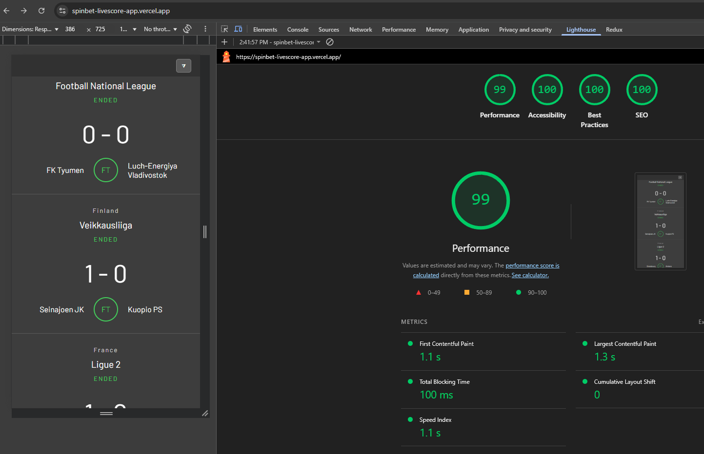
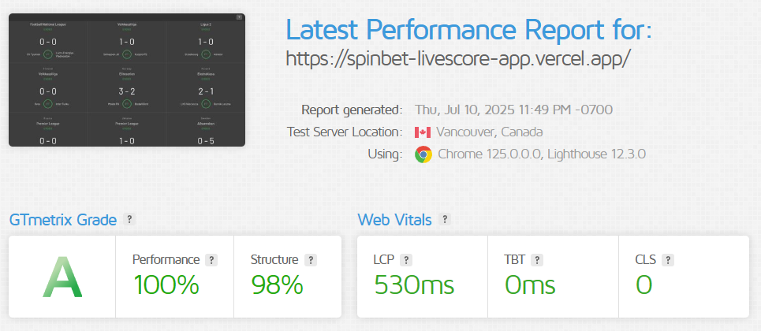
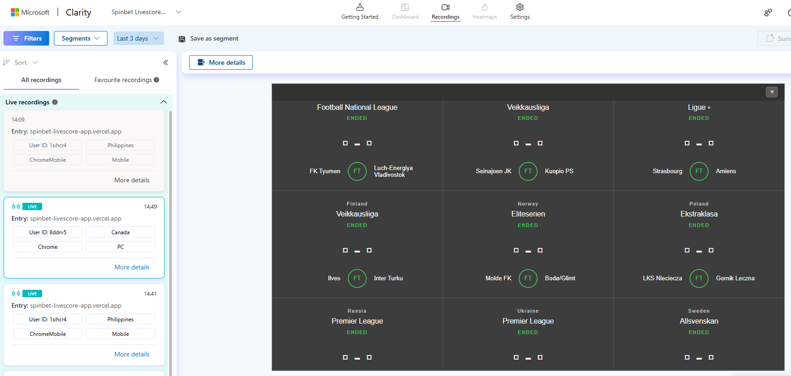
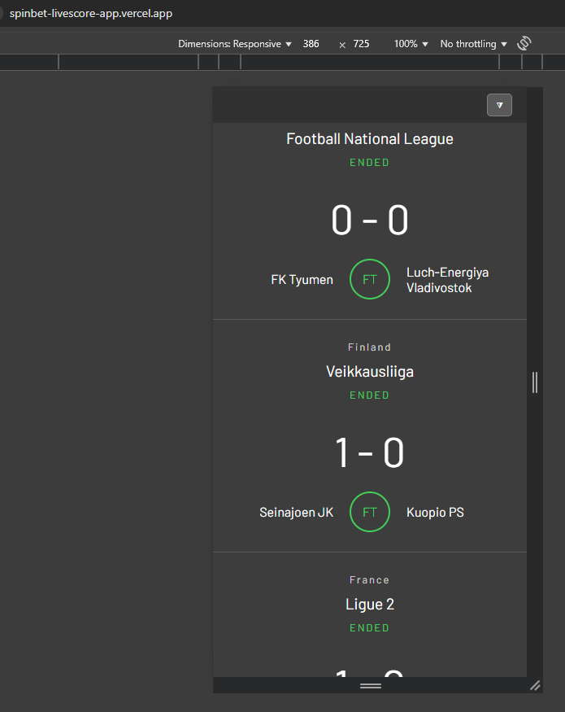
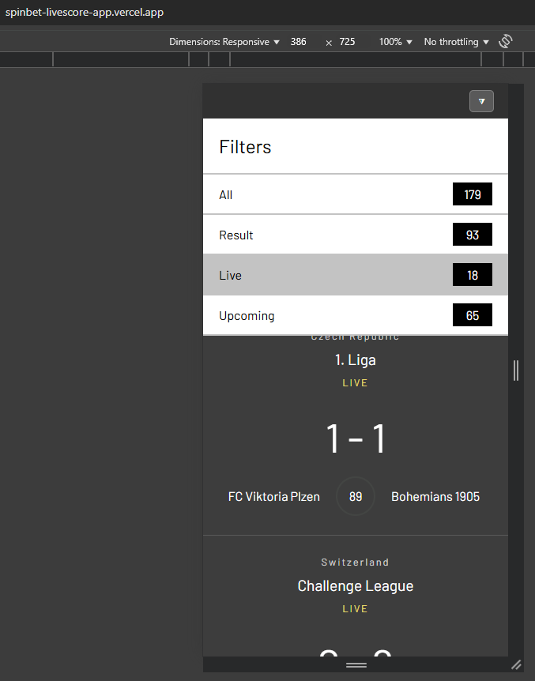
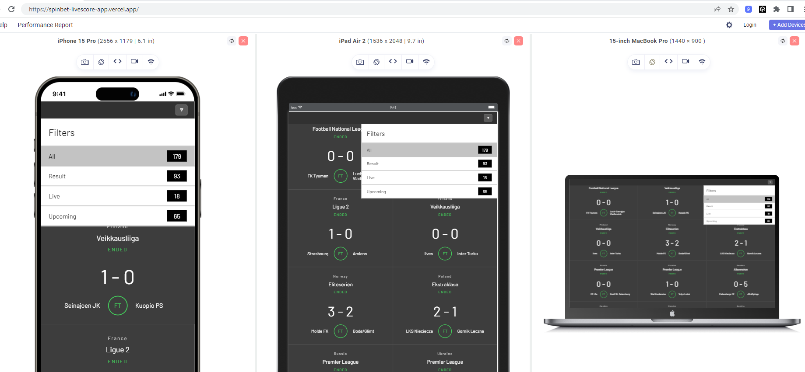

# 🎯 Spinbet Livescore App

A modern, responsive livescore web application built with **Next.js** and **Styled Component**. SpinBet delivers sports scores with a clean UI and fast performance.

🌐 [Live Demo](https://spinbet-livescore-app.vercel.app/)  

🌐 [Live API Demo](https://spinbet-livescore-api.onrender.com/api/v1/livescore) 

📦 [GitHub App Repository](https://github.com/emersonbarrion/spinbet-livescore-app)

📦 [GitHub Api Repository](https://github.com/emersonbarrion/spinbet-livescore-api)

---
## 🛠️ Tech Stack

| Stack                | Deployment  |
|----------------------|-------------|
| Next.js (frontend)   | Vercel      |
| Express.js (backend) | Render.com  |

| Stack                 | Code Quality             |
|-----------------------|--------------------------|
| Prettier              | Formatter                |
| ESLint                | Linter                   |
| Typescript            | Type-safe                |
| JSCPD                 | Detect duplicate code    |
| Jest                  | Unit Testing             |
| React Testing Library | Component Testing        |
| Storybook             | Component Visual Testing |
| Cypress               | End to End Testing       |


---

## 🚀 Features

### Functionality
- ⚡ Display list of match with scores
- 🔍 Able to filter match by status
- 📱 Seamless experience across devices

### Performance
- Lighthouse

- GTmetrix


### Monitoring
- Microsoft Clarity

- Sentry.io - TBA
---


---

## 📸 Screenshots




---

## 📦 Installation

```bash
# Clone the repo
git clone https://github.com/emersonbarrion/spinbet-livescore-app.git
cd spinbet-livescore-app

# Install dependencies
npm install

# Run locally
npm run dev

# Run code quality check - includes format, lint, unit test, component test and jscpd
npm run check

# Run Storybook - app should be running
npm run storybook 

# Run E2E - app should be running
npm run e2e

# Run E2E Headless mode
npm run e2e:headless
